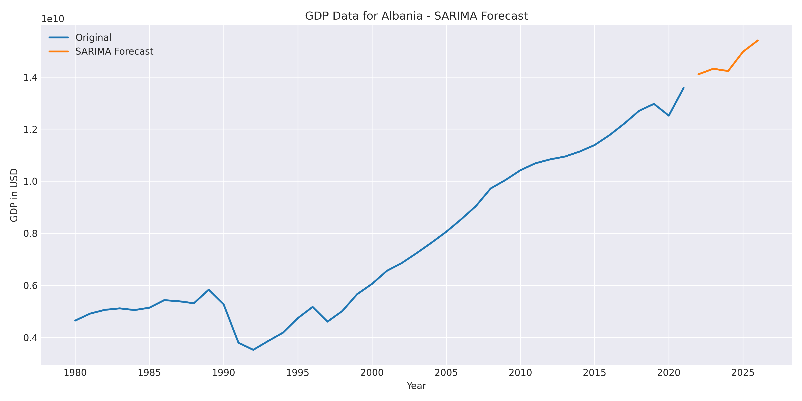

# Forecastrr-ML 📈

Forecastrr-ML is a Python project that forecasts Albania's GDP using different time series models, including ARIMA, SES, and SARIMA. The project fetches real-time GDP data, decomposes the time series, and fits various models to forecast the next five years. The best model is determined by comparing the forecast errors (MAE, MSE, RMSE) of each model.



## 📚 Dependencies

- pandas
- numpy
- matplotlib
- statsmodels
- pandas_datareader

## 📦 Installation

1. Clone the repository:

```
git clone https://github.com/dalist1/forecastrr-ml.git
```

2. Install the required packages:

```
pip install -r requirements.txt
```

3. Run the script:

```
python forecastrr.py
```

## 📈 Models

- **ARIMA** (Autoregressive Integrated Moving Average): A linear time series model that combines autoregression, differencing, and moving average components to make predictions. [Source 0](https://raw.githubusercontent.com/dalist1/forecastrr-ml/master/forecastrr.py)

- **SES** (Simple Exponential Smoothing): A time series forecasting method that uses weighted averages of past observations to make predictions. [Source 0](https://raw.githubusercontent.com/dalist1/forecastrr-ml/master/forecastrr.py)

- **SARIMA** (Seasonal Autoregressive Integrated Moving Average): An extension of ARIMA that takes seasonality into account, making it suitable for forecasting data with seasonal patterns. [Source 0](https://raw.githubusercontent.com/dalist1/forecastrr-ml/master/forecastrr.py)

## 📊 Results

The script generates forecasts for the next five years using each of the models. The best model is determined by comparing the forecast errors (MAE, MSE, RMSE) of each model. An example output can be seen below:

```
The best model for GDP forecasting is: SARIMA
MAE: 478414004.52, MSE: 260072867367300608.00, RMSE: 509973398.69
```

## 🖼️ Plots

The script generates plots for the original GDP data, the decomposed time series (trend, seasonal, residual), and the forecasts for each model. The plots are saved as PNG files in the project directory. [Source 0](https://raw.githubusercontent.com/dalist1/forecastrr-ml/master/forecastrr.py)

## 📝 License

This project is licensed under the MIT License.
